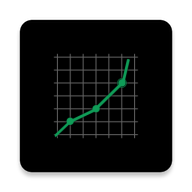

<p align="center">
  
</p>
<h1 align="center">
  Stock Watch
</h1>
<p align="center">
  A modern, lightweight Stock monitoring android app with a minimalist design.
</p>
<p align="center">
   <a style="text-decoration:none" href="release/">
    
  </a>
  <a style="text-decoration:none">
    
  </a>
  
   <a style="text-decoration:none" href = "https://github.com/chiragkhandhar/Stock-Watch/releases/download/1.1/Stock.Watch.apk">
    
  </a>
  
</p>

## What is Stock Watch and why do I care?

I have been waiting long enough for a simplistic Android Stock Monitoring app to come so I
decide to create one myself. Don’t get me wrong, Robinhood, TD Ameritrade Mobile, Acorns are great apps. 
I have used them and I will continue to use them in the future. However, they are primarily designed for trading and you can't use them unless and until you signup and provide your Bank and SSN details.
Thus, I wanted an App which allows me to add my choice of Stocks that I wish to monitor on my dashboard, and should be able to give the latest real-time prices. No Sign-Ups, no advertisements, simply plug and play.  Most importantly,
it had to be blazingly fast and simplistic to everyone. 

So here comes the “Stock Watch” 🎉.

* Material Design.
* Blazingly fast and lightweight.
* Dark Mode.
* No Sign Up.
* No Bank/SSN/Personal Details.
* Plug and Play.
* Local Storage.
* No Ads, No Pop-ups.
* Real-time Prices.
* Major Cryptocurrency Support.
* [Market Watch](https://www.marketwatch.com/) integration for individual stock.


******* 📣 Stock Watch is still evolving. *******

## Status update / Downloads :

[[03-20-2020] Version 1.0](release/)

## Platform limitations :

* This is an Android Application, Apologies iOS users (and Windows users).
* This app works great with Android Oreo (API 26) and above.
* The watchlisted stocks are locally stored, so once you uninstall / clear your app data, you will loose your shortlisted stocks.
* Stock Watch is powered by [IEX Cloud](https://iexcloud.io/), thus the correctness of data is limited to the data provider.

* IEX Cloud provides only 50000 API requests per free account. If the app is out of request you can follow the following steps to create your on token and replace in the source code in [StockLoader.java](src/main/java/ml/chiragkhandhar/stockwatch/StockLoader.java) file.
  * Go to: [IEX Cloud Register](https://iexcloud.io/cloud-login#/register)
  * Select "Individual"
  * Enter your name, email address, and select a password.
  * Click the terms checkbox and click "Create acount"
  * Select the "START" plan (0/mo) - click Select Start
  * Go to your email - look for message with Subject "IEX Cloud Email Verification"
  * Click the iexcloud.io link in the email.
  * From the page that link opens, click 'API Tokens" in the upper-left (under Home)
 * Query Format: ```https://cloud.iexapis.com/stable/stock/STOCK_SYMBOL/quote?token=API_KEY```


## Disclaimer and Privacy statement:

To be 100% transparent:

* Stock Watch does not and will never collect user information in terms of user privacy.
* I will not track your IP. 
* I will not record your shortlistings or any of your stocks on your dashboard in Stock Watch. 
* No personal data or files will be sent to me or third parties. 

I might use analytics tools to collect basic usage data such as how many times the program has been downloaded.

Feel free to review the source code.

## Contributing:

* Stock Watch is free and open source, if you like my work, please consider:
   * Star this project on GitHub
   * Endorse me [here](https://www.linkedin.com/in/chirag-khandhar/)


## Stay tuned 📢

